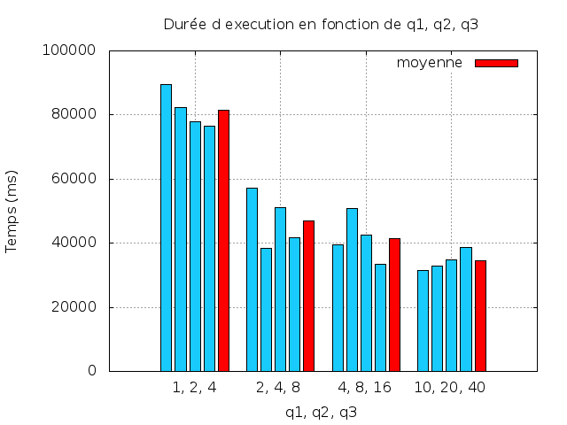
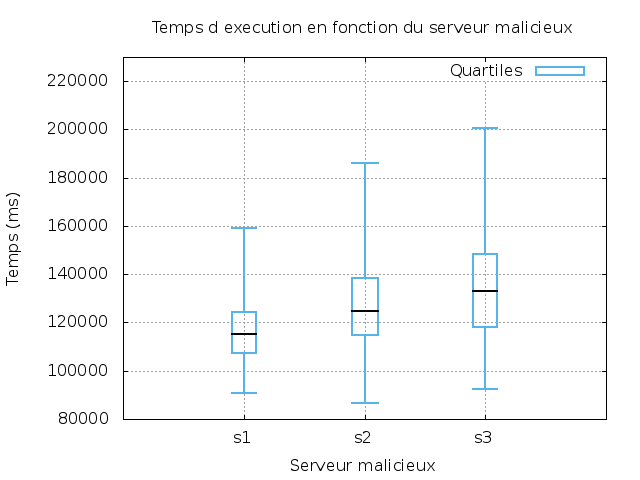

# Tests de performance
## Protocole de test

Dans les lignes suivantes, nous considérerons que le répartiteur est l'ordinateur *L4712-01.info.polymtl.ca*.

Nous lançons rmiregistry sur le port 5001 sur le répartiteur dans le dossier bin.
`rmiregistry 5001 &`.  

Puis en revenant dans le dossier principal, on lance l'application java : ` ./master ressources/donnees-4712.txt L4712-01.info.polymtl.ca:5001 secured`.  

On se connecte ensuite à chaque serveur de calcul, et on lance la commande : `./slave 10 0 L4712-01.info.polymtl.ca:5001`.  

*On notera que le calcul du plus grand nombre premier semble faux : en effet le plus grand nombre premier en dessous de 207926 est 207923 alors que notre serveur de calcul renvoie 103963. Nous garderons ce résultat quand même, car c'est celui qui est attendu à la fin. En effet, nous trouvons bien 2317 comme résultat.*

A partir de cette expérimentation de référence, autrement dit notre témoin, nous allons faire varier plusieurs variables pour cerner le comportement de notre application.

## Mode sécurisé

Dans ce test de performance en mode sécurisé, on lance 3 serveurs de calcul avec un seuil de tâches acceptées différents.  

Nous avons fait varier la taille des tâches acceptées par les serveurs et nous avons pu obtenir le résultat ci-dessous :

| q1, q2, q3 | resultat1 | resultat2 | resultat3 | resultat4 | moyenne |
|------------|-----------|-----------|-----------|-----------|---------|
| 1, 2, 4    | 89402     | 82436     | 77827     | 76567     | 81536   |
| 2, 4, 8    | 57119     | 38291     | 51155     | 41800     | 47091   |
| 4, 8, 16   | 39558     | 50698     | 42532     | 33505     | 41573   |
| 10, 20, 40 | 31553     | 32741     | 34744     | 38553     | 34397   |

Etant donné les quelques variations imputables à la machine virtuelle Java, au réseau et aux autres machines sur le réseau, nous avons réalisé 4 jeux de tests, sur lesquelles nous avons calculé une moyenne (Figure 1). Nous n'avons pas jugé nécessaire d'effectuer plus de tests. En effet, la partie aléatoire n'est pas aussi importante que dans la seconde partie.  

Nous avons envoyé exclusivement des tâches contenant 10 opérations. Pour les besoins de la simulation lorsqu'un serveur refuse une tâche, il la calcule tout de même mais ne renvoie pas son résultat, car il a refusé la tâche. Ainsi, il consomme du temps et ne se rend pas disponible immédiatement.

Avec un taux d'acceptation faible, on constate des durées de calcul beaucoup plus longue. Ces durées de calcul sont dues aux nombreux refus, qui retardent le traitement de la tâche.

En se rapprochant de 10, on constate que la différence avec le calcul optimal est plus faible. En effet, avec q1 = 4, on a que 16% des tâches qui sont refusées sur q1. 

A partir de q1 = 10, et au delà, les performances restent identiques. Nos serveurs de calculs acceptent toutes les tâches et fonctionnent à plein régime. 

## Mode non-sécurisé

A partir des résultats précédement obtenus, nous avons décidé de choisir q1=2, q2=4 et q3=8.  
Nous avons éxécuté notre application dans le mode malicieux dans trois cas de figure différents :

1. Premier serveur malicieux 50% du temps, deux autres serveurs de bonne foi.
2. Deuxième serveur malicieux 50% du temps, deux autres serveurs de bonne foi.
3. Troisième serveur malicieux 50% du temps, deux autres serveurs de bonne foi.

Les résultats en terme de temps d'éxécution obtenus sont :

| Servur Malicieux | Minimum | 1er Quartile | Mediane | 3eme Quartile | Maximum | Taille | 
|------------------|---------|--------------|---------|---------------|---------|--------| 
| s1               | 90841   | 107519       | 115114  | 124512        | 159215  | 112    | 
| s2               | 86700   | 114948       | 124885  | 138307        | 186144  | 133    | 
| 33               | 92284   | 118311       | 132990  | 148287        | 200553  | 366    | 

Nous avons tout d'abord constaté que les données n'étaient pas constantes et variaient fortement. Nous avons associé ce comportement au caractère aléatoire des refus. Afin d'obtenir des données de bonne qualité, nous avons du prendre en compte ce facteur. Pour cela, nous avons décidé de réaliser un grand nombre de mesure, et d'utiliser des diagrammes en boite pour représenter leur répartition. On constate que les valeurs minimales sont toutes sensiblement identiques. Cela est dut au fait que le jeu de test associé à cette valeur a du se dérouler sans erreur. Nous sommes donc dans un cas optimum. Mais quand nous nous intéressons à la valeur médiane, nous nous rendons compte que le temps d'execution est le plus long pour q3 et le plus court pour q1. En effet, si le serveur malicieux est celui ayant la plus grande capacité, il va prendre plus de tâches, et causer donc plus d'erreurs et le traitement sera de ce fait aussi plus long.

# Question 1

Pour résister aux pannes du répartiteur, notre application devrait adopter une architecture totalement différente de celle adoptée actuellement.  
En effet, il faudrait y intégrer un processus d'élection, qui ferait qu'il n'y aurait que des serveurs de calcul à l'origine et que n'importe lequel de ces serveurs puisse demander une élection, suivant, par exemple, la méthode par anneaux.  

L'avantage de notre solution est que le développement est plus facile, pas besoin de gérer des serveurs hybride. Par contre notre solution actuelle n'est pas résistante en cas de panne du répartiteur.

# Implémentation
## Répartiteur

Le répartiteur est contenu dans la classe nommée **MasterImpl**, qui implémente l'interface **Master** (interface partagée avec les serveurs de calcul).  

La première chose que fait le répartiteur est de récupérer les arguments (fichier de donnée, mode et adresse du répartiteur) et de les valider.  

Cette étape faite, l'objet **Master** est enregistré au près de RMI (adresse donnée en paramètre). Après cela, le fichier de données est parsé, on obtient donc une liste **ArrayList** de calculs.  

Les calculs peuvent ensuite commencer. La répartition des calculs se sépare en plusieurs étapes. Toutes les étapes ci-dessous sont contenues dans une boucle qui vérifie si oui ou non, tous les calculs ont été fait.  

  1. Génération de tâches (une tâche est une liste d'opérations, au nombre de 10 à la première occurance de la boucle);  
  2. Lancement des tâches dans des threads;  
    1. Récupération d'un serveur de calcul libre (attente active, avec une pause de 500ms);
    2. Envoie de la tâche au serveur;  
    3. Récupération de l'acceptation ou non de la tâche (réussite d'allocation de ressources);  
    4. Si non acceptée : variable `nbErrorOnSize` incrémentée;  
  3. `join` sur tous les threads créés;  
  4. Redéfinition de la taille des tâches si besoin;  

La redéfinition de la taille de tâche est faite si 20% ou plus des serveurs de calcul ont renvoyés une erreur d'allocation de ressource. Dans ce cas là, la taille des tâche est diminuée et elle sont renvoyées aux serveurs de caulcul.   

Lors de la réception de résultat, on ajoute le résultat obtenu dans la liste de résultats du calcul effectué. On ne valide le résultat que si le mode est sécurisé, sinon, on vérifie que 50% des résultats du calcul sont égaux.  

Les pannes intenpestives provenant d'un serveur de calcul sont relevées à partir d'une exception RemoteException qui serait levée. Si tel est le cas, le répartiteur tente de trouver un autre serveur de calcul.  

## Serveur de calcul

Le serveur de calcul est contenu dans la classe nommée **SlaveImpl**, qui implémente l'interface **Slave** (interface partagée avec le répartiteur).  

La première chose que fait le serveur de calcul est de récupérer les arguments (nombre d'opérations maximum, pourcentage de maliciosité et adresse de répartiteur) et de les valider.  

On envoie ensuite au master ce serveur de calcul, ainsi, il a connaissance de sa présence.  

La méthode `sendTask()` a pour rôle d'effectuer les opérations envoyés en paramètre, mais avant cela, elle vérifie si elle peut allouer suffisament de ressources, si non, elle retourne faux. Dans tous les cas, elle effectue les calculs afin de consommer du temps, si l'allocation de ressources n'a pas pu être faite, les résultats ne sont juste pas renvoyés au master.

Chaque calculs est effectué et renvoyé au répartiteur. Si le serveur est malicieux, il rend une valeur différente de celle normalement obtenue.  

