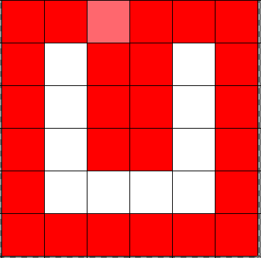

INF4710 - LAB1
==============

1811002 - Quentin Dufour
1810978 - Loïc Pelleau

Taux
----

### Résultats

Voici la sortie brute des taux de compression RLE et Freeman pour chaque image (respectivement test.png, test2.png, test3.png, test4.png, test5.png, test6.png et test7.png) :

```
RLE stats || orig: 307200, enc: 4320, ratio: 71
Freeman stats || orig: 307200, enc: 5144, ratio: 59

RLE stats || orig: 114002, enc: 1350, ratio: 84
Freeman stats || orig: 114002, enc: 10835, ratio: 10

RLE stats || orig: 116535, enc: 20340, ratio: 5
Freeman stats || orig: 116535, enc: 10771, ratio: 10

RLE stats || orig: 921600, enc: 12518, ratio: 73
Freeman stats || orig: 921600, enc: 12563, ratio: 73

RLE stats || orig: 441045, enc: 5610, ratio: 78
Freeman stats || orig: 441045, enc: 3448, ratio: 127

RLE stats || orig: 282375, enc: 14984, ratio: 18
Freeman stats || orig: 282375, enc: 8148, ratio: 34

RLE stats || orig: 110010, enc: 8934, ratio: 12
Freeman stats || orig: 110010, enc: 17118, ratio: 6

```

### RLE

On remarque des taux de compression très hétérogènes, allant de 5 à 71 pour RLE. Assez intuitivement, on constate que le taux de compression le plus favorable correspond à l'image possédant des lignes horizontales. Ce qui est normale, ayant implémenté notre RLE en ligne par ligne, ce dernier favorise la compression des données redondantes en ligne. Pour la même raison, nous obtenons de très mauvais résultats pour les formes verticales de la troisième image.

La première, la quatrième et la cinquième image proposées sont constitutées de grandes formes très peu "dentelées", ce qui aboutit à des lignes très constantes, et encore une fois, nous avons un bon taux de compression.

Les deux dernières images, l'une dentelée, l'autre avec de petits carrés ont de piètres scores. En effet, avec une lecture ligne par ligne, dans les deux cas nous oscillons toujours entre blanc et noir.

### Freeman

Freeman ne rencontre pas le problème de RLE vis à vis des formes verticales ou horizontales. Lors de formes simples, et très répétitives, il est moins efficace que RLE, pour peu que la forme soit dans le sens d'encodage de ce dernier. Toute la puissance de ce dernier se révèle dans le cas de grandes formes, plus ou moins complexes. Particulièrement l'image 5 qui représente des grands cercles, et l'image 6 qui représente une seule forme mais très cisaillée.

Par contre, lorsque le nombre de forme augmente, se dernier se montre assez peu efficace, comme pour les images 7, 2 et 3.

En conclusion, certaines formes d'images sont propices à RLE, d'autres à Freeman. Quant on n'entre pas dans les cas particuliers de ces algorithmes, leur taux de compression est assez semblable.

Question 1
----------

La compression RLE sera meilleure par colonne lorsque les formes de l'image seront majoritairement dans la hauteur, comme des rectangles avec une hauteur importante et une largeur faible. C'est dû à un changement plus faible de couleurs, donc à une moindre utilisation de mémoire.

Question 2
----------

Les chaines au format RRRRGGGGGGBBBBB sont nécessaires au format RLE car il se base sur le principe des répétitions, il faut donc que ces données soient sucesptibles d'être répétées. Il y a moins de différences dans un même chanel sur deux pixels côte à côte qu’entre deux chanels différents d’un même pixel. Les canaux R, G et B étant indépendants, nous ne pourrions pas profiter de cette compression efficacement si nous avions fait le choix d'utilier RGBRGBRGB.

Question 3
----------

RLE ne tient compte que d'une seule des deux dimensions, qui fait qu'elle est moins efficace que Freeman, qui profite des deux dimensions de l'image. Cependant, RLE est plus facile à implémenter et intuitif. En utilisant les contours, il n'est pas nécessaire de coder l'aire de l'image par contre, cela peut poser problème sur certaines formes qui ne seront pas reproduites fidèlement, par exemple un carré avec son centre vide.

Question 4
----------

Seul deux images ont un peu de pertes (5 pixels de différence pour la première, et 174 pixels de différence pour la sixième). Cette perte se produit lorsque la fonction detectBinaryEdges produit les contours, en effet cette dernière dilate l'image, ce qui peut aboutir à une perte d'information. Par exemple, si on a l'image suivante :



Si on est sur la case rose (x = 2, y = 0), alors Freeman va encoder un EAST, alors que pour éviter une perte d'information éventuelle, il aurait du coder un SUD.

Le cas est encore plus critique si on avait eu un U moins large d'un pixel. Freeman n'aurait pas eu de chemin de retour.

Pour résoudre ces problèmes, on pourrait ne pas effacer les pixels parcourus, mais tenir une liste de ces derniers, toujours tourner le plus possible par rapport à la dernière direction (et non pas par rapport à la direction de référence), sans jamais revenir sur un pixel déjà parcouru. Si on se retrouve dans un chemin sans possibilité, alors on remonte sur un pixel déjà parcouru jusqu'à trouver un chemin avec un pixel non parcouru.
