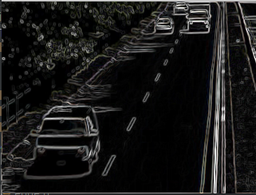
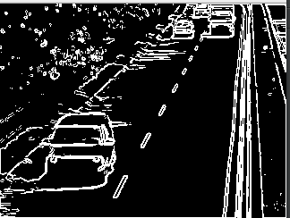
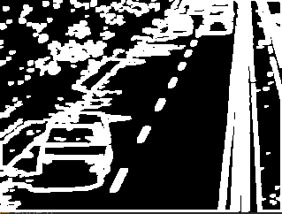
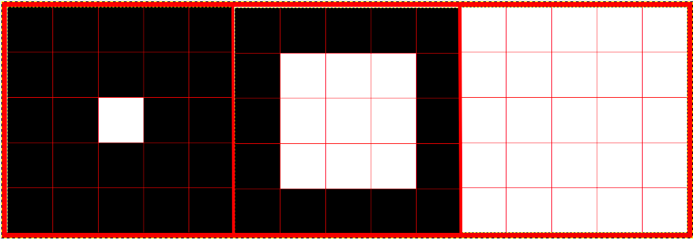
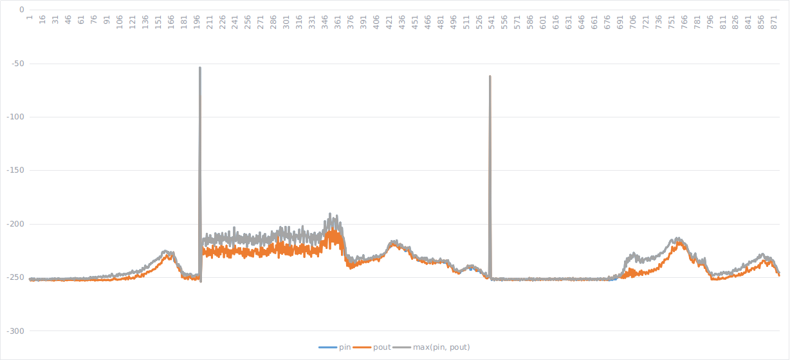

# Architecture de la solution

Nous avons réalisé notre projet en C++ à l'aide de la bibliothèque OpenCV. Notre objectif est de détecter les 
changements de scène. Pour ce faire, nous avons découpé notre problème en plusieurs modules. Nous avons tout d'abord
appliqué un filtre de sobel (via des convolutions), puis de seuillage sur les valeurs obtenues et enfin nous avons dilaté
ces dernières. L'objectif final est la détection d'arêtes de l'image.

## Module de convolution

La convolution consiste à appliquer une transformation sur chaque pixel de notre image.

Notre filtre de sobel n'est au final que deux convolutions initialisées avec des valeurs particulières propre au filtre 
de Sobel. Ces deux traitement : horizontal et vertical sont ensuite assemblés pour obtenir une valeur pour chaque pixel 
de l'image.

Ces valeurs doivent être normalisées avant de pouvoir être affichées. En effet, nous avons des valeurs très disparates,
et qui peuvent fluctuer.
Afin de faciliter le traitement nous avons traité ces valeurs pour qu'elles se trouvent entre 0 et 1. 
La plus petite valeur de notre jeu de donnée aura pour valeur 0, la plus grande aura pour valeur 1.
Afin de pouvoir afficher notre résultat, nous convertissons ces valeurs en des entiers compris dans l'intervalle 0-255.

Le filtre de sobel permet de détecter les contours d'une image, qui apparaissent alors en couleurs.
Le résultat n'est pas directement exploitable par notre programme. 

## Module de seuillage

Le seuillage permet d'obtenir une image binaire à partir des trois canaux ayant des valeurs dans un intervalle 0-255.
Cette image sera plus simple à traiter par la suite pour notre prise de décision.

Le seuillage consiste à comparer chaque pixel de notre image à une valeur définie préalablement (automatiquement ou 
manuellement). Si cette valeur est plus grande, alors notre résultat est 1 (ou 255), sinon il vaut 0. 

Il existe plusieurs techniques différentes pour obtenir un seuillage.
Nous revenons plus précisément sur l'implémentation de ce dernier et nos différents tests dans la partie suivante.

La Figure 2 présente le seuillage que nous avons obtenu à partir de la Figure 1.

## Module de dilatation

Le module de dilatation est un traitement qui vient s'appliquer sur notre seuillage. Il permet d'améliorer l'information
en essayant de reconstituer les arêtes coupées.

Pour chaque pixel de notre seuillage, si nous trouvons un pixel blanc (égale à 1 ou 255), nous définissons les pixels
voisins à la même valeur. 

Nous avons fait en sorte de pouvoir choisir la "puissance" de la dilatation. Ainsi pour une
dilatation de 2, ce sont tous les pixels à une distance de 2 du pixel étudié qui seront passés à 2.
La Figure 4 présente une image de 3x3 pixels avec un pixel blanc en son centre et le résultat donné par notre dilatation
pour une valeur de 1 et 2.

# Etude du seuillage

Nous avons étudié différentes méthodes de calcule pour le seuillage sur nos images.  

## Seuillage simple

Au dessus d'une certaine valeur, on met la valeur à 255. En dessous, on la définit à 0.
On pourrait additionner les valeurs des 3 canaux et définir un seuil.
Une autre solution est de définir un seuil qu'un des trois canaux doit dépasser.

## Seuillage double

On choisit de ne garder que les valeurs dans un certains intervalle. 
De même que pour le seuillage simple, nous pouvons appliquer un seuillage double sur les caneaux cumulés.

## Définition des bornes

Le seuil pourrait être défini en fonction de l'image à traiter et par caneaux. 
Nous aurions des résultats adaptés à l'image en cours de traitement pa rapport à la distribution des couleurs. 
Nous n'avons pas implémenté cette solution car trop complexe à développer.

## Solution retenue

Après avoir observé les résultats obtenus avec les différents seuillages, nous avons décidé de conserver un seuillage simple avec addition des valeurs des trois caneaux.

Nous avons placé notre seuil à 0,6. En effet, les valeurs de nos trois canaux sont compris entre 0 et 1, notre valeur cumulée est donc comprise entre 0 et 3. 0.6/3 = 20%, nous avons donc décidé de retenir tous les points ayant au moins 20% de luminosité sur les trois canaux cumulés.

Après expérimentation, c'est cette méthode qui nous rendait le résultat de meilleur qualité, même si le résultat des autres techniques était sensiblement identique en fonction des seuils choisis.

Cette technique a l'avantage d'être simple d'utilisation et de rendre des résultats intéressants. Cependant, elle peut poser problème dans des cas particuliers, entre autre à cause du seuil fixe. Une amélioration de cette technique serait de pouvoir rendre dynamique le seuil en fonction de l'image à analyser.

Etude de la détection des transitions, gradations et fondus
===========================================================

Pour détecter des changements dans l'image, nous avons calculé deux composants : Pin et Pout pour chaque image de notre vidéo. 
Pin représente le nombre d'arêtes entrantes dans l'image, et Pout, le nombre d'arêtes sortantes. Nous avons aussi calculé la valeur maximum entre Pin et Pout que nous appeleront P (*P = max(Pin, Pout)*).
Nous avons donc basé toutes nos analyses suivantes sur ces trois valeurs.

Afin de détecter les coupures, nous avons observé la valeur P.
Comme mentionné dans le cours, une coupure est observée à l'arrivée d'un pic de P.
Nous avons choisi un seuil dynamique pour détecter ces coupures.
Ainsi, nous commençons par calculer la moyenne de P sur l'ensemble de la vidéo.
Si la valeur de P associée à notre image est supérieur à 0.5 fois la moyenne, alors nous considérons qu'il y a coupure.

Nous avons détecté les gradations lorsque Pin et Pout étaient différents. 

Après expérience, nous avons ajouté une condition supplémentaire afin de limiter les faux-positifs: la valeur de P doit être supérieur à la moyenne additionnée à la moitié de l'écart type de P : `P > moyenne(P) + 0.5*ecart_type(P)`.

Enfin, les fondus ont été detectées lorsque à l'image i, Pin est supérieur à Pout, puis à l'image i+1, Pin est inférieur à Pout : `Pin(i) > Pout(i) && Pin(i+1) < Pout(i+1)`.

Résultats sur la vidéo
======================

On peut constater en premier lieu sur le graphique deux pics nets facilement reconnaissables, ce sont les coupures. Juste avant le premier pic, on constate une évolution des données pouvant être assimilée à un fondu, ce qui n'est pas le cas. Après le premier pic, les valeurs de P sont constantes mais supérieurs à la moyenne, et varient de manière importance. Cette zone correspond au plan sur la rivière. Juste après, la détection de la scène du vélo n'est pas de très bonne qualité (beaucoup de variation dans P). Nous arrivons alors à la seconde coupure (le second pic). La scène du stationnement est très intéressante, car les valeurs de P sont très basses. A sa fin, on peut constater une évolution de P correspondant à la transition. Finalement, les dernières fluctuations de P sont encore et toujours dues au camion qui se déplace rapidement.

Grâce à nos méthodes de calculs, nous avons été capable de détecter toutes les coupures dans la vidéo.  

Par contre, notre méthode de détection ne nous a pas permis de découvrir toutes les gradations et fondus.
Nous avons même détecté des gradation et fondus à des endroits où il n'y en a pas. 

Entre autre, nous avons constaté des problèmes avec les images sur l'eau, qui est en mouvement perpétuel et sans point réellement fixe (voir graphique ci-dessus). De même pour le camion, qui se déplace trop vite et qui est considéré comme un fondu par notre analyse. Dans ces cas, notre algorithme détecte un nombre d'arêtes entrantes et sortantes trop important, qu'il interprète comme une transition.

# Analyse des problèmes et pistes d'amélioration

Les erreurs de détection sont dues au fait que nos seuils ne sont pas calibrés à la perfection. 
Ce dernier manque alors un peu de précision. 
Notre algorithme de détection est lui-même peut-être aussi coupable de ces mauvais résultats. 
Un algorithme un peu plus poussé aurait pu aider à trouver les évènements recherchés plus efficacement.

Suite à ces constats, les améliorations suivantes sont envisageables.
Nous pourrrions peut-être ajouter un pré traitement pour détecter les éléments perturbateurs comme l'eau.
Nous avons aussi évoqué précédemment que le seuillage pourrait être amélioré pour s'adapter dynamiquement à l'image.
Enfin, des traitements statistiques plus poussés sur l'image pourraient aussi permettre de détecter ces transitions.
Nous avons aussi pensé à détecter les horizons de transition.
